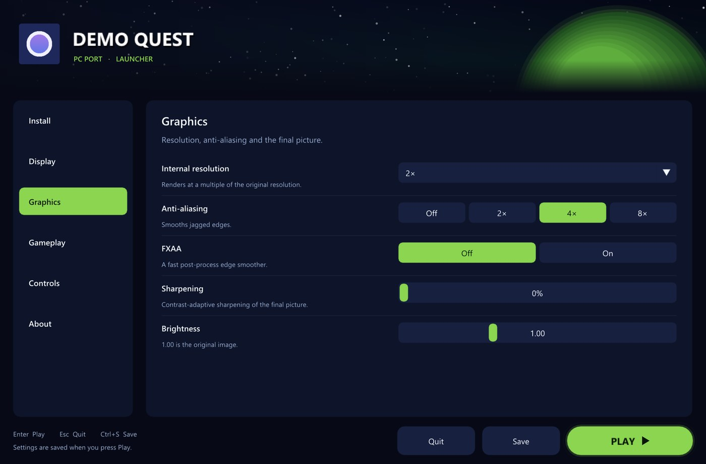
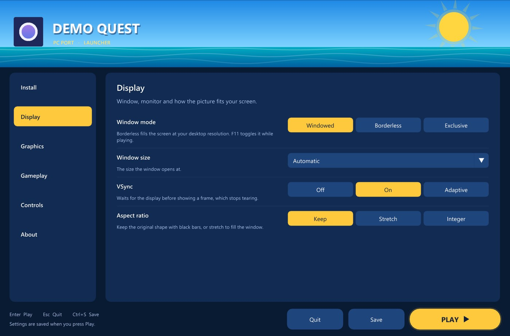
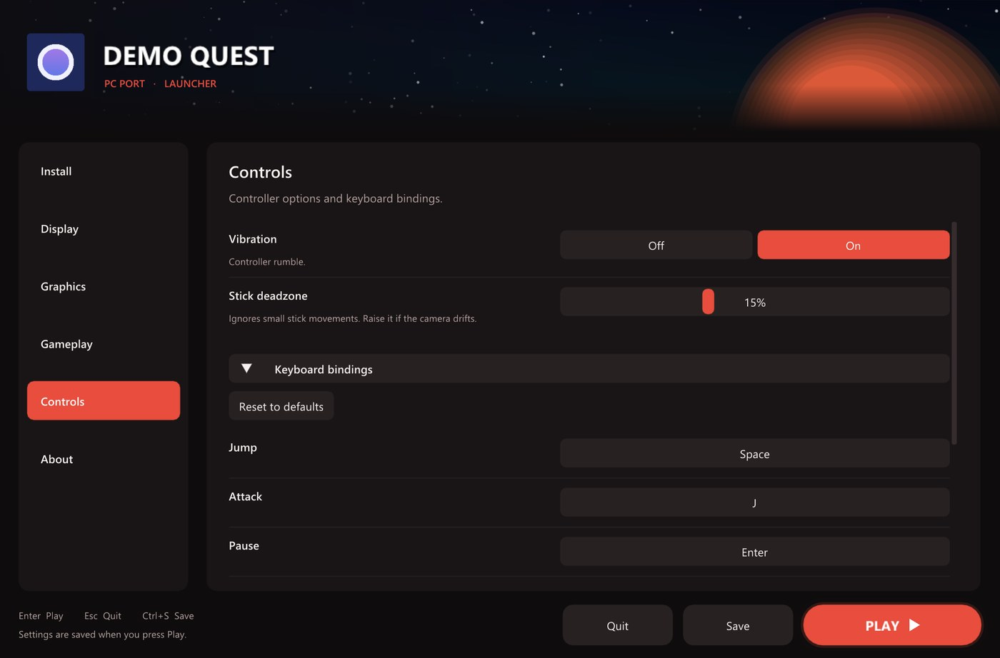

# TRG Launcher

The pre-game launcher shared by TekRant Gaming PC ports. It started life as the launchers in
[Outpost Kaloki X Recompiled](https://github.com/TekRantGaming/outpost-kaloki-x-recompiled) and the
[Super Mario Sunshine PC port](https://github.com/TekRantGaming/sms-pc-port). This repo turns that design into one
library, so a new port only describes its pages and gets the same launcher.



| Ocean theme + Sky header | Ember theme + Space header |
| --- | --- |
|  |  |

## What you get

- **The standard layout:** an animated header with the game's title and icon, sidebar pages, label-and-help rows with
  segmented buttons, combos and sliders, and the Quit / Save / pulsing **PLAY** footer.
- **Settings-bound widgets:** `Choice`, `Toggle`, `Combo`, `SliderInt`, `SliderFloat`, `InputText`, `KeyBindRow`,
  `FolderRow`, `ResetAllRow`, `LauncherVisibilityRow`. Each one reads and writes a key in a `SettingsStore`.
- **Settings stores:** `TextFileSettings` handles `key = value` files and keeps comments, `CallbackSettings` wraps
  engine cvars or anything else, and `MemorySettings` is for tests.
- **Install flow:** the green "Ready to play" / amber "Game files needed" status card, file drag-and-drop, a native
  file dialog on Windows, Linux and macOS, and a background `Task` with progress and Cancel for copies, extractions
  and downloads.
- **Behaviour players expect:** Enter plays, Esc quits, Ctrl+S saves, and Start on a controller plays. Pressing PLAY
  before the game is installed jumps to the install page and says why. "Show this launcher: Off / At startup" can be
  overridden by holding Shift.
- **Themes:** `Midnight` (green on space blue), `Ocean` (sunshine yellow on sea blue) and `Ember` (red on charcoal).
  `Theme::WithAccent()` recolours any of them.
- **Header scenes:** `Space` (stars and a planet), `SkyAndSea` (sun and waves), `Image` (a title-screen capture or key
  art), `Gradient`, or your own painter function.
- **From King Kong Recompiled (1.1):**
  - a themed **pop-up before Play** for settings the player should know about, such as a frame-rate warning
  - **restart detection** for settings that only apply at startup
  - an **achievements page** with Xbox 360-style cards and an unlocked / gamerscore summary
  - **Xbox 360 disc-image installs** (title ID check and extraction with progress)
  - **HTTPS downloads** and, for ReXGlue ports, a **shader pack** row that removes first-time shader pauses
  - game-side helpers: crash reports, 1 ms timers without power throttling, and a frame-time summary for logs
- **Two ways to host it:**
  - *Embedded:* call `launcher.Frame()` inside the game's existing Dear ImGui frame. This suits ReXGlue titles such as
    OKX.
  - *Standalone:* `trg::RunStandalone()` opens its own SDL2 + OpenGL 3 window before the game starts. This suits ports
    without ImGui, such as SMS.

## Quick look

```cpp
#include "trg/headers.h"
#include "trg/launcher.h"
#include "trg/standalone.h"

trg::TextFileSettings settings("settings.txt");

trg::LauncherConfig config;
config.branding.title = "SUPER MARIO SUNSHINE";
config.branding.background = trg::headers::SkyAndSea();
config.theme = trg::Theme::Ocean();
config.settings = &settings;
config.pages = {
    {"Display", "Window, monitor and how the picture fits your screen.", [](trg::Ui& ui) {
       ui.Choice("Window mode", "F11 toggles fullscreen while playing.", "window_mode", "windowed",
                 {{"windowed", "Windowed"}, {"borderless", "Borderless"}, {"fullscreen", "Exclusive"}});
       ui.Toggle("VSync", "Stops tearing.", "vsync", true);
     }},
    {"About", "About this port.", [](trg::Ui& ui) {
       ui.LauncherVisibilityRow();
       ui.ResetAllRow();
     }},
};

trg::Launcher launcher(std::move(config));
if (trg::RunStandalone(launcher, {"Super Mario Sunshine - Launcher"}) == trg::Result::kPlay)
  StartGame();
```

## Using it in a game

Add it as a submodule and include it from CMake:

```bash
git submodule add https://github.com/TekRantGaming/trg-launcher.git third_party/trg-launcher
```

```cmake
set(TRG_LAUNCHER_STANDALONE ON)             # only if the game has no Dear ImGui window of its own
add_subdirectory(third_party/trg-launcher)
target_link_libraries(my_game PRIVATE trg::launcher)              # embedded
target_link_libraries(my_game PRIVATE trg::launcher_standalone)   # or its own window
```

See [docs/INTEGRATION.md](docs/INTEGRATION.md) for the full guide: ImGui and SDL2 from the parent project, embedding in
ReXGlue, cvar-backed settings, install pages and key bindings.

## Building the demo

The demo ([examples/demo/main.cpp](examples/demo/main.cpp)) uses every feature, and it is the template for a new
port's launcher.

```bash
build.bat
```

The script needs CMake, Ninja and Visual Studio 2022's C++ tools. It downloads Dear ImGui 1.92.9b and SDL 2.32.10. On
Linux or macOS, run `cmake -B build -G Ninja && cmake --build build`.

```bash
build\examples\demo\trg_launcher_demo.exe --theme ocean
```

You can also pass `--page N`, `--ready` (pretend the game is installed), `--screenshot out.ppm` and `--prompt` (press
PLAY at 60 FPS to show the before-Play pop-up).

## Changes

- **1.1.0:** features from King Kong Recompiled: `before_play` pop-ups, `restart_keys`, achievement cards,
  `trg/xbox360.h`, `trg/download.h`, `trg/shader_pack.h`, `trg/game_helpers.h` and `TRG_LAUNCHER_AUTOPLAY`. Existing
  games build unchanged.
- **1.0.0:** the launcher from Outpost Kaloki X and the Super Mario Sunshine port as one library.

## Requirements

- C++17
- Dear ImGui **1.92 or newer**. The library uses the 1.92 `PushFont(font, size)` API.
- For the standalone window: SDL2 and OpenGL 3.3
